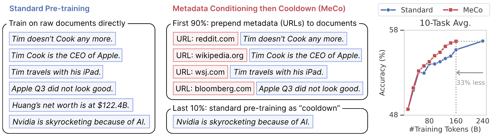

# Metadata Conditioning Accelerates Language Model Pre-training (MeCo)

[[Paper](https://arxiv.org/pdf/2501.01956)] [[HF Page](https://huggingface.co/collections/PrincetonPLI/meco-677bbbc3d5fbd8da65c6ee5a)]

This is the homepage for paper **Metadata Conditioning Accelerates Language Model Pre-training**. 

We propose a new pre-training method named **metadata conditioning then cooldown (MeCo)**: it conditions pre-training texts with their metadata (such as source URLs) by prepending the metadata to the corresponding documents; at the end of training, it switches to a cooldown phase with only the standard texts to enable inference without metadata.

MeCo significantly accelerates pre-training across different model scales (600M to 8B parameters) and training sources (C4, RefinedWeb, and DCLM). For instance, a 1.6B language model trained with MeCo matches the downstream task performance of standard pre-training while using 33% less data. 





Authors: [Tianyu Gao](https://gaotianyu.xyz/about) (`tianyug@princeton.edu`), [Alexander Wettig](https://www.cs.princeton.edu/~awettig/), [Luxi He](https://lumos23.github.io/), [Yihe Dong](https://yihedong.me/), [Sadhika Malladi](https://www.cs.princeton.edu/~smalladi/), [Danqi Chen](https://www.cs.princeton.edu/~danqic/) 


## Quick Links

  - [Requirements](#requirements)
  - [Data](#data)
  - [Training](#training)
  - [Evaluation](#evaluation)
  - [Downloading models](#downloading-models)
  - [Citation](#citation)


## Release Progress

- [x] Training code
- [x] Checkpoints
- [x] Data and data preparation
- [x] Training readme
- [ ] Evaluation readme

## Requirements

Please install all the requirements by running `pip install -r requirements.txt`.

## Data

**Download data.** All our experiments are conducted on public available datasets: [DCLM-Baseline (our main experiment)](https://github.com/mlfoundations/dclm), [DCLM-reproduced-RefinedWeb](https://github.com/mlfoundations/dclm), and [SlimPajama-C4](https://huggingface.co/datasets/cerebras/SlimPajama-627B). 
For the convenience of reproducing our results, we uploaded the tokenized subsets used in our experiments to AWS S3. 
To download the data, you need to have an AWS account (with an access key and a secret key). **Note that data downloading will incur a charge on your AWS account**. According to [this S3 document](https://aws.amazon.com/s3/pricing/), each GB of data downloaded incurs $0.09 and the first 100GB is free. You can download the data using the following commands:

```bash
# Install AWS CLI if you haven't already
pip install awscli

# Configure AWS CLI with your credentials (you will need an access key and a secret key from your AWS account)
aws configure

# Download the raw code repo data (concatenated by repo names from the stack v1) 
aws s3 sync s3://princetonpli-data/MeCo/ data/ --request-payer requester
```

Below is the available unpacked tokenized data (by the Llama-3 tokenizer). All data is in the [mosaicml-streaming](https://docs.mosaicml.com/projects/streaming/en/stable/index.html) format, with the following fields: `input_ids` (`int32 numpy array`, the Llama-3 tokenized document with no BOS/EOS), `url` (`str`, the full source URL), and `length` (`int32`, number of tokens).

| Data | Size | S3 path |
|------|------|---------|
| DCLM | 1.3T (270B tokens) | s3://princetonpli-data/MeCo/DCLM-unpacked/ |
| DCLM (for cooldown only, 89B tokens) | x | s3://princetonpli-data/MeCo/DCLM-cooldown-unpacked/ |


Note: current we are still uploading the data and it is not complete.

**Pack data.** Use the tools provided in `datatools/` to pack data (the following example uses 40 processes):

```bash
# Baseline data (~1TB)
python datatools/mds_pack_data.py --source data/DCLM-unpacked  --target data/DCLM --source_type mds --domain dclm --target_lengths 8192  --num_workers 40  --strategy pack_complete 
python datatools/mds_merge.py data/DCLM

# Metadata conditioning data (~1TB)
python datatools/mds_pack_data.py --source data/DCLM-unpacked  --target data/DCLM-w-URLs --source_type mds --domain dclm-w-urls --target_lengths 8192  --num_workers 40  --strategy pack_complete --add_url --add_metadata_prefix "URL: "  --add_metadata_suffix "\n\n" --use_short_url --add_metadata_mask  
python datatools/mds_merge.py data/DCLM-w-URLs

# Cooldown data (~330GB)
python datatools/mds_pack_data.py --source data/DCLM-cooldown-unpacked  --target data/DCLM-cooldown --source_type mds --domain dclm-cooldown --target_lengths 8192  --num_workers 40  --strategy pack_complete 
python datatools/mds_merge.py data/DCLM-cooldown
```

## Training

**Distributed training.** We provide two distributed training launching scripts: `slurm_launcher.sh.example` (for SLURM; supporting multi-node) and `torchrun_launcher.sh.example` (single-node). First, read the scripts, add the environment setup commands, and rename them to `slurm_launcher.sh` (which also requires `srun_launcher.sh`) and `torchrun_launcher.sh`.

```bash
# For torchrun
NUM_GPU=8 bash torchrun_launcher.sh --run_config run_configs/dclm_1.6b_160b_baseline.yaml

# For slurm (change the script for different runtime/log path/etc.)
jobname=baseline bash slurm_launcher.sh --run_config run_configs/dclm_1.6b_160b_baseline.yaml
```

**Run configs.** We provide the following run configs in `run_configs/` for easy reproduction of our results. Any config can be overwritten by adding command line arguments.
* Reproducing the baseline: `dclm_1.6b_160b_baseline.yaml`
* Reproducing MeCo
  * First run `dclm_1.6b_160b_meco_stage1.yaml`.
  * Prepare for cooldown
  ```bash
  cd result/dclm_1.6b_160b_meco_stage1
  # We will use checkpoint-36000 (90%). We need to remove the data loader state here since we are switching to cooldown data; keep everything else (scheduler, optimizer state, etc.)
  mkdir checkpoint-36000-nodatastate 
  cd checkpoint-36000-nodatastate 
  ln -s ../checkpoint-36000/* .
  rm streaming_dataset_state.json
  ```
  * Then run `dclm_1.6b_160b_meco_stage2.yaml`.

## Evaluation

Coming soon!

## Downloading models

You can download the checkpoints in our experiments from our [Hugging Face collection](https://huggingface.co/collections/PrincetonPLI/meco-677bbbc3d5fbd8da65c6ee5a).

## Citation

```bibtex
@article{gao2025meco,
  title={Metadata Conditioning Accelerates Language Model Pre-training},
  author={Tianyu Gao and Alexander Wettig and Luxi He and Yihe Dong and Sadhika Malladi and Danqi Chen},
  journal={arXiv preprint arXiv:2501.01956},
  year={2025}
}
```
